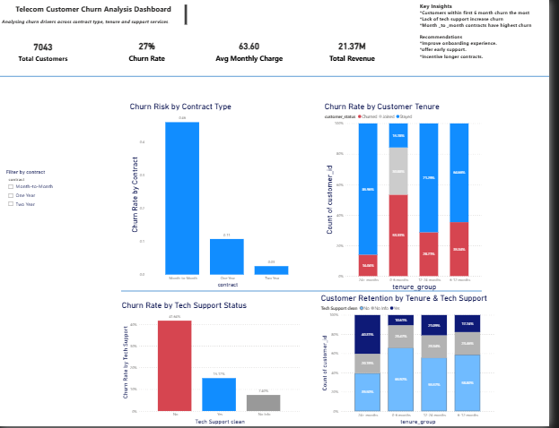

# Telecom-Customer-Churn-Analysis 

  

📊 Telecom Customer Churn Analysis

## 🧠 Project Overview

We all use telecom.

Whether it’s MTN, Airtel, or any other provider — staying connected is part of everyday life. But behind every call, every data subscription, and every message… there’s a silent business challenge:

Why do customers leave?

This project explores customer churn behavior using data to uncover not just what is happening — but why.

---

## 🔍 Key Insight

Customer churn is not random.

It is predictable, patterned, and concentrated.

- The highest churn occurs within the first 0–6 months
- Customers on month-to-month contracts are most at risk
- Lack of tech support and service engagement increases churn significantly

👉 Customers don’t just leave suddenly —  
churn builds over time.

---

## ⚠️ Problem Breakdown

From the analysis:

- Early-stage customers are the most vulnerable  
- Flexible contracts reduce commitment  
- Missing support services creates poor customer experience  

This shows that churn is not just a pricing issue —  
it is an experience problem.

---

## 💡 Business Implications

To reduce churn, telecom companies should focus on:

- Improving onboarding experience  
- Encouraging tech support adoption  
- Promoting long-term contracts  

Retention is driven by:

✔ Experience  
✔ Engagement  
✔ Commitment  

---

## 📊 Dashboard Highlights

The dashboard provides insights into:

- Churn rate by contract type  
- Customer churn across tenure groups  
- Impact of tech support on churn  
- Retention patterns based on tenure and support  

---

## 🛠 Tools Used

- SQL (Data Extraction & Transformation)  
- Power BI (Data Visualization & Dashboarding)  

---

## ❤️ Final Reflection

This project reminded me that behind every data point is a person.

Churn isn’t just a number —  
it’s a reflection of customer experience.

And when we understand that,  
we don’t just analyze data…

👉 *We tell better stories.
